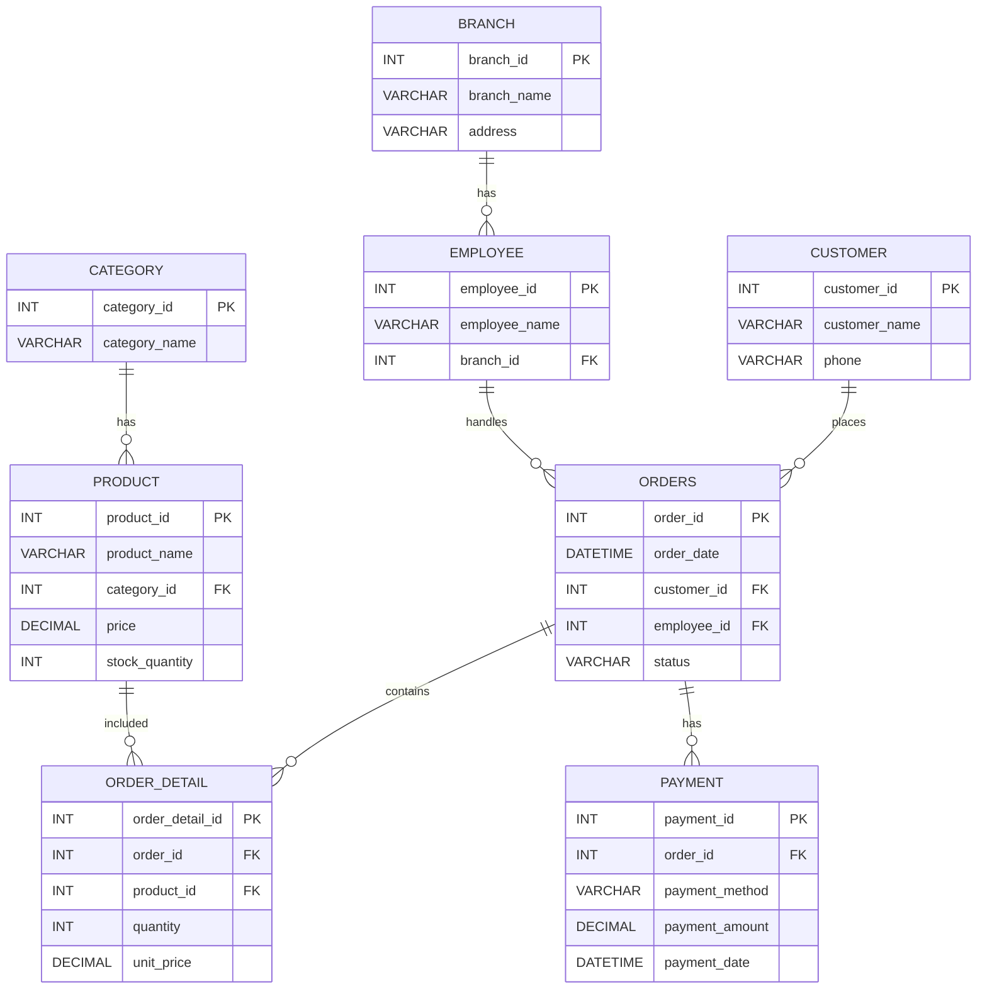

# ER Diagram

## Гол холбоосууд

- Category 1:N Product
- Branch 1:N Employee
- Customer 1:N Orders
- Employee 1:N Orders
- Orders 1:N OrderDetail
- Product 1:N OrderDetail
- Orders 1:N Payment

`Orders` болон `Product`-ийн M:N холбоог `OrderDetail` хүснэгтээр шийдсэн.
