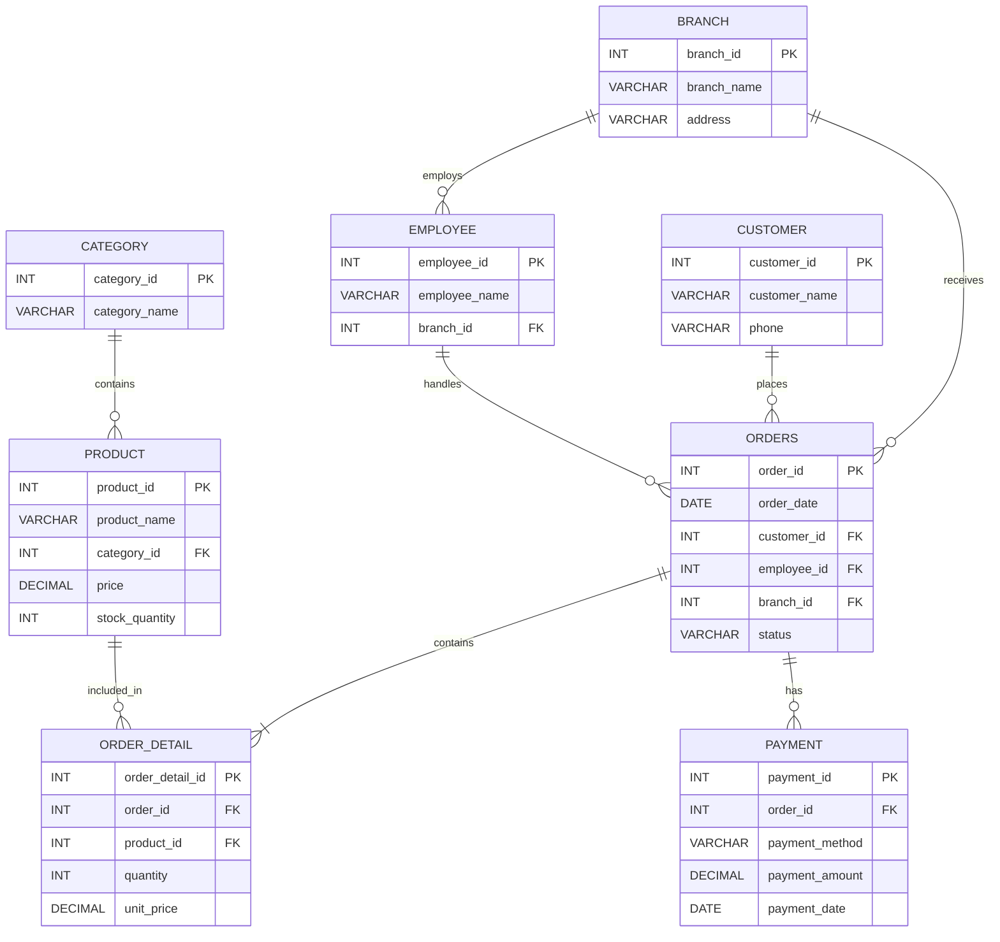

# ER Diagram

```mermaid
erDiagram

    CATEGORY ||--o{ PRODUCT : contains

    BRANCH ||--o{ EMPLOYEE : employs

    CUSTOMER ||--o{ ORDERS : places

    EMPLOYEE ||--o{ ORDERS : handles

    BRANCH ||--o{ ORDERS : receives

    ORDERS ||--|{ ORDER_DETAIL : contains

    PRODUCT ||--o{ ORDER_DETAIL : included_in

    ORDERS ||--o{ PAYMENT : has


    CATEGORY {
        INT category_id PK
        VARCHAR category_name
    }

    PRODUCT {
        INT product_id PK
        VARCHAR product_name
        INT category_id FK
        DECIMAL price
        INT stock_quantity
    }

    CUSTOMER {
        INT customer_id PK
        VARCHAR customer_name
        VARCHAR phone
    }

    BRANCH {
        INT branch_id PK
        VARCHAR branch_name
        VARCHAR address
    }

    EMPLOYEE {
        INT employee_id PK
        VARCHAR employee_name
        INT branch_id FK
    }

    ORDERS {
        INT order_id PK
        DATE order_date
        INT customer_id FK
        INT employee_id FK
        INT branch_id FK
        VARCHAR status
    }

    ORDER_DETAIL {
        INT order_detail_id PK
        INT order_id FK
        INT product_id FK
        INT quantity
        DECIMAL unit_price
    }

    PAYMENT {
        INT payment_id PK
        INT order_id FK
        VARCHAR payment_method
        DECIMAL payment_amount
        DATE payment_date
    }
```
